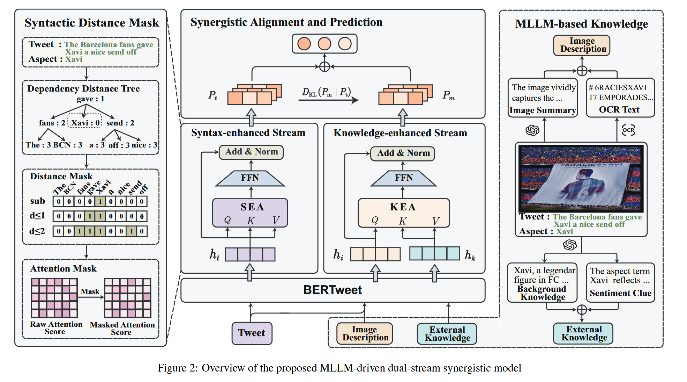
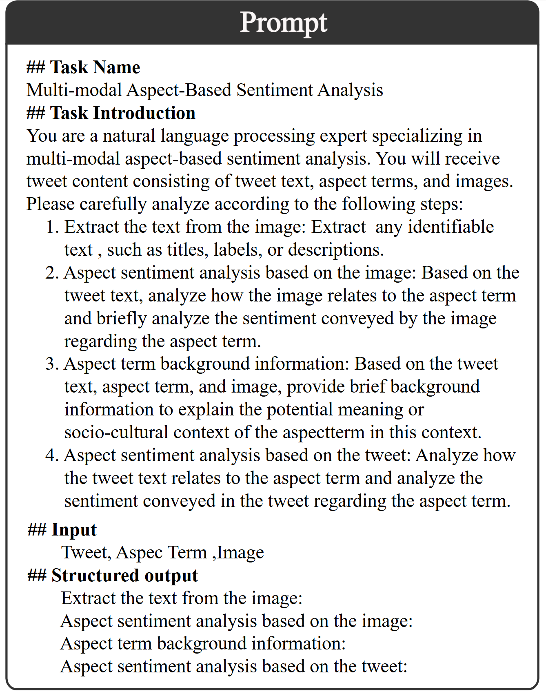
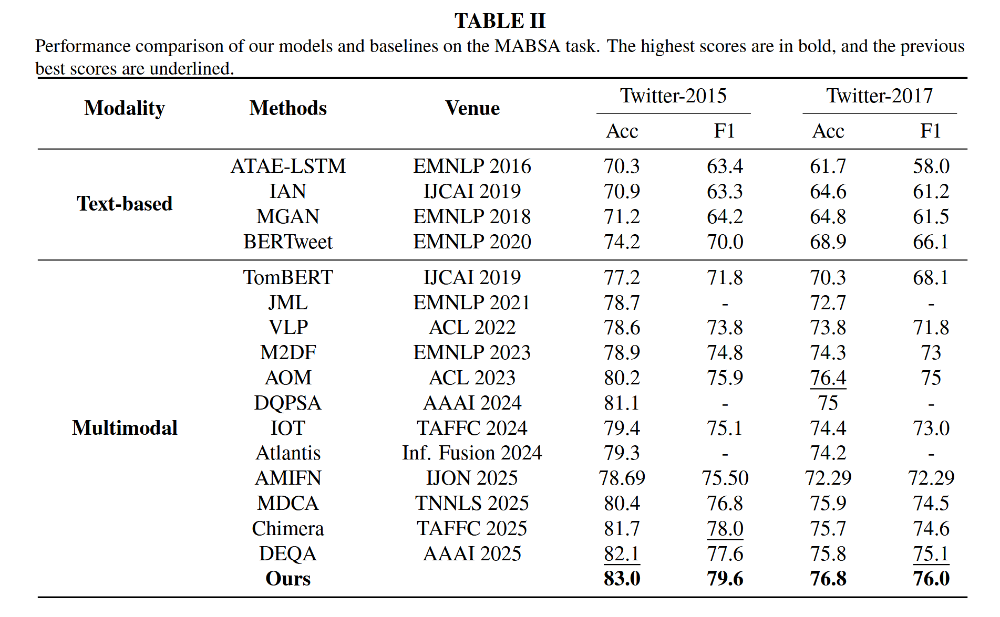

# LLM-DSS

Code for our paper:
MLLM-based dual-stream synergistic model for multimodal aspect-based sentiment analysis

## Abstract

Multimodal aspect-based sentiment analysis (MABSA) aims to determine the sentiment polarity toward specific aspects within image–text content, thereby supporting public-opinion analysis and information mining. However, existing methods face two key challenges: (i) cross-modal interactions may hinder the learning of syntactic structure; and (ii) external knowledge is often not fully exploited to enrich the aspect context. To address these issues, we propose an MLLM-based dual-stream synergistic model (LLM-DSS). Specifically, to balance cross-modal interaction and syntactic structure learning, we adopt a parallel dual-stream architecture. We construct a knowledge-enhanced multimodal stream and a syntax-enhanced text stream, respectively, and introduce a collaborative alignment mechanism to promote synergistic modeling across different streams. To supplement aspectual context and bridge modal gaps, we leverage MLLM to generate aspect-relevant external knowledge and image descriptions. Additionally, we designed a Context-aware Knowledge Filter Module (CFK) and a Multi-View Syntactic Fusion Module (MSF) to filter redundant external knowledge and aggregate multi-view syntactic information, respectively. Experiments on two public MABSA datasets demonstrate that the proposed method achieves state-of-the-art performance.

## Prompt Template

### three-step prompting to evaluate end-to-end sentiment inference with MLLMs

You are a natural language sentiment analysis expert. You will receive a set of tweet-aspect term-image inputs, where each aspect term has only one sentiment polarity (neutral, positive, or negative). Your task is to determine the sentiment polarity of each aspect term based on the context provided in the tweet and the corresponding images. You must ensure that only tweets that explicitly convey sentiment are assigned a positive or negative polarity. Please provide the sentiment judgment for each aspect term concisely along with the reasoning.

"`<think>` Given the tweet {}, what’s the sentiment polarity towards aspect term {}, why? Let’s think step by step. The mentioned aspect towards {} is about ... The underlying opinion towards {} is about ... Therefore, the sentiment polarity towards {} is ... ".format(tweet, aspect, aspect, aspect, aspect, aspect,aspect)

### Main Results

### Enviroment

**Please refer to the complete conda environment provided in environment.yml . Kindly resolve any potential package conflicts on your own.**

### Datasets

**We provide the preprocessed datasets, and the sources of the original datasets are listed as follows.** [TomBERT](https://dl.acm.org/doi/10.1145/3474085.3475692)

## Citation

If our work has been helpful to you, please mark references to our work in your research and thank you for your support.

## Note

* Code of this repo heavily relies on [IOT](https://github.com/qlwang25/image2text_conversion).
